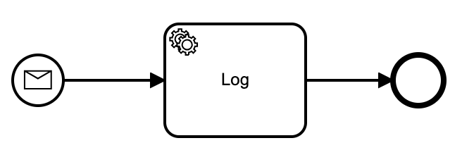
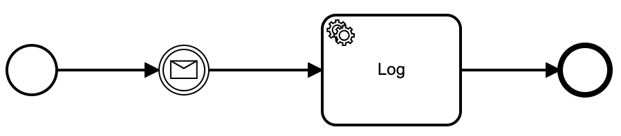
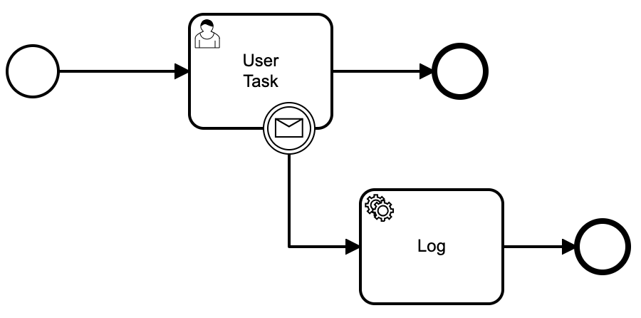
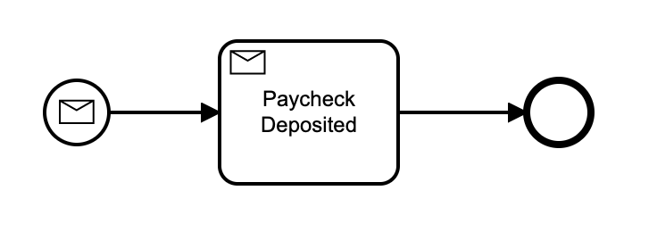
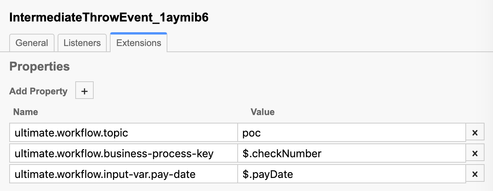

## Camunda Message Streaming

This library allows BPMN designers to declaratively define what values, from an incoming JSON based message, will be used to correlate to a Process or a Process Instance (e.g. Execution).  Message values are evaluated at runtime using JSON Path expressions which are stored within the BPMN.

The following Message Events are supported:
=====
#### Start Events


#### Intermediate Catch Events


#### Interrupting & Non-interrupting Boundary Catch Events


#### Receive Tasks



The following extension semantics are currently supported
====== 
Using the modeler you can assign extensions to a 
Start Event, Message Catch Event, Boundary Event, or a Receive Task.

> Note: {prefix} defaults to `ultimate.workflow` but can be configured via the application properties

##### {prefix}.topic={topic-name}
Sets the topic value you wish to save with the extension data, 
to be used for message consumers to establish connections for correlation messages.

Example usage: 
```
String topic = messageTypeExtensionData.getTopic();

topicContainerManager.createOrStartConsumer(topic, listener);
```


##### {prefix}.business-process-key={json-path}
Assigns the business process key that will be used to start a new process or match on a currently running process
> Note: This can also be declared as `{prefix}.match-var.business-process-key={json-path}`
Java equivalent:
```
processEngine.getRuntimeService()
    .createMessageCorrelation("com.acme.messages.important-event")
    .processInstanceBusinessKey("key")
```

##### {prefix}.match-var.{variable-name}={json-path}
Creates a match requirement on a variable whose name is defined by {variable-name}

Java equivalent:
```
processEngine.getRuntimeService()
    .createMessageCorrelation("com.acme.messages.important-event")
    .processVariableValueEquals("key", "value")
```         

##### {prefix}.match-local-var.{variable-name}={json-path}
Creates a match requirement on a local variable whose name is defined by {variable-name}

Java equivalent:
```
processEngine.getRuntimeService()
    .createMessageCorrelation("com.acme.messages.important-event")
    .variableValueEquals("key", "value")
```

##### {prefix}.input-var.{variable-name}={json-path}
Sets a variable, whose name is defined by {variable-name}

Java equivalent:
```
processEngine.getRuntimeService()
    .createMessageCorrelation("com.acme.messages.important-event")
    .setVariable("key", "value")
```


Links
=====
* [Getting Started Guide](docs/GET_STARTED.md)
* [Correlation Logic Example](docs/correlation-logic-example.md)
* [References](docs/REFERENCES.md)
