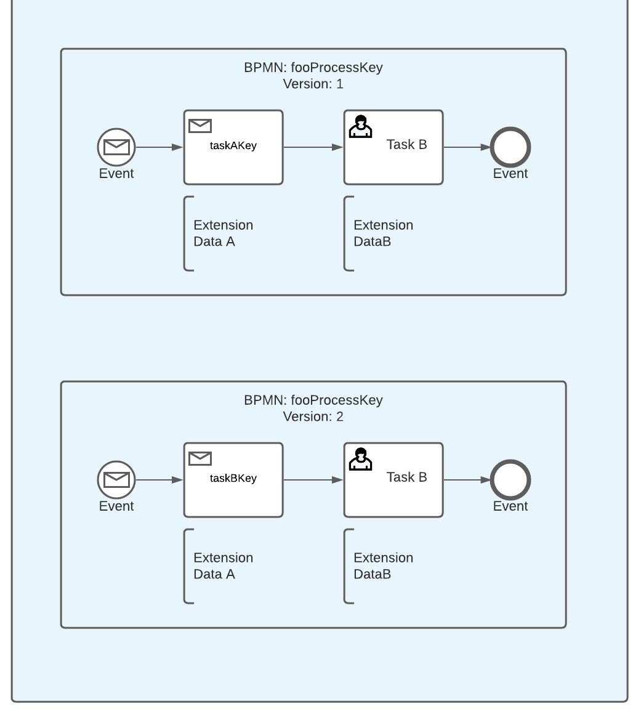
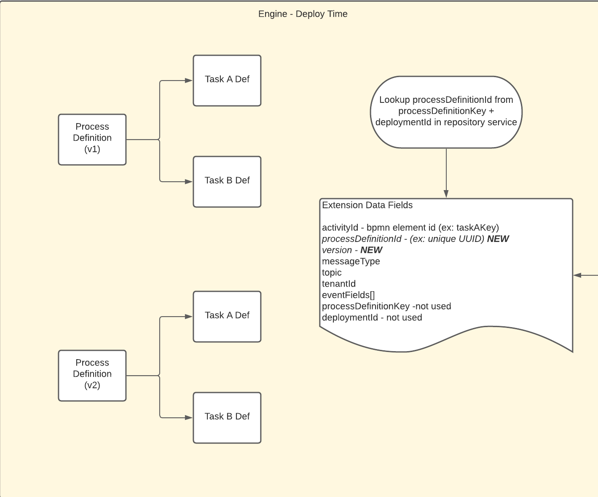
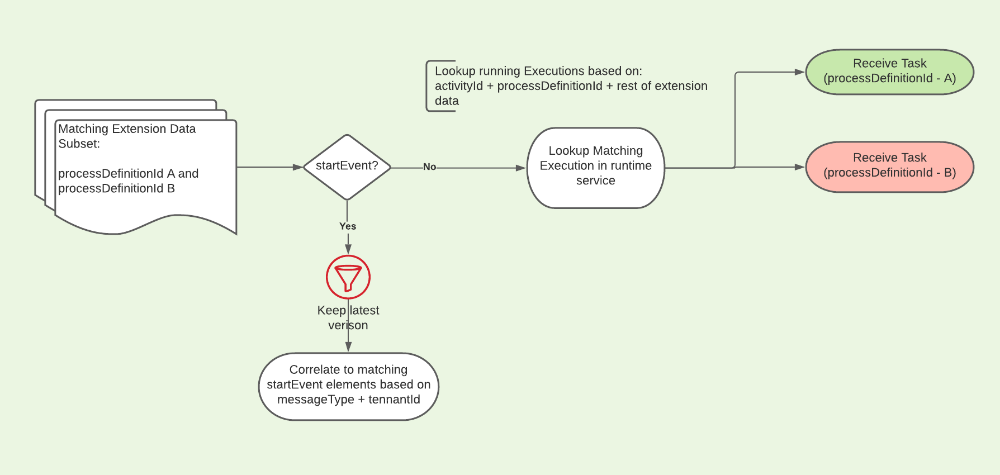

## Correlation Logic Example

Let's look at an example of how the library might handle working with multiple versions of a BPMN.

Here we might have two similar versions of a BPMN deployed into a running Camunda engine instance.

When the deployment is occurring, it will parse out any Message based elements such as 
Message Start Event, Receive Task, Catch Event, etc, and create some [ExtensionData](../messaging/src/main/java/com/ultimatesoftware/workflow/messaging/bpmnparsing/MessageTypeExtensionData.java) 
based on the defined properties within that element's xml. 

This is done by the [MessageExtensionBpmnParse](../messaging/src/main/java/com/ultimatesoftware/workflow/messaging/bpmnparsing/MessageExtensionBpmnParse.java)
class.

> Note: The Extension Data's Process Definition Id field is set as part of the post deploy logic,
since it is not available at deployment time. 
>
> If defining your own custom process engine configuration, please ensure that the 
[PostBpmnDeployExtensionDataInitializerPlugin](../messaging/src/main/java/com/ultimatesoftware/workflow/messaging/bpmnparsing/PostBpmnDeployExtensionDataInitializerPlugin.java)
bean is present.                                   

At runtime, when message has been received and the generic correlator is being called,
it will use the Extension Data available to build correlation data and determine if there is an active execution in which to correlate
the message to. 

> Note: The correlation will only occur if a unique result is found. 
Proper usage of match variables should be defined for each element in order to achieve this result. 

> All start messages will currently be correlated to the latest version of that 
process definition key + tenant id pairing. In the future, we plan to support correlating to specific versions.

> Note: This is the out of the box way the library handles correlation. You can also define your own
custom correlator to change this behaviour. 